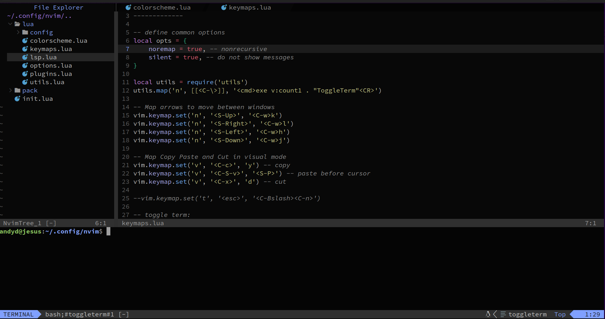
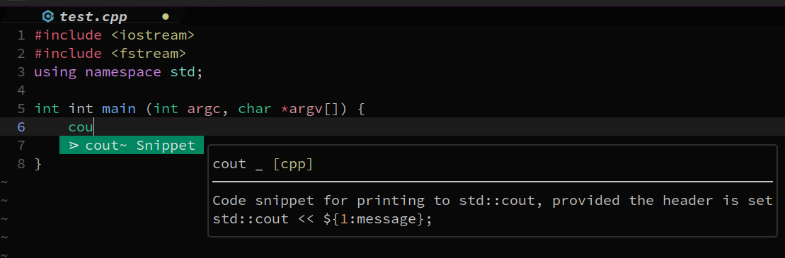
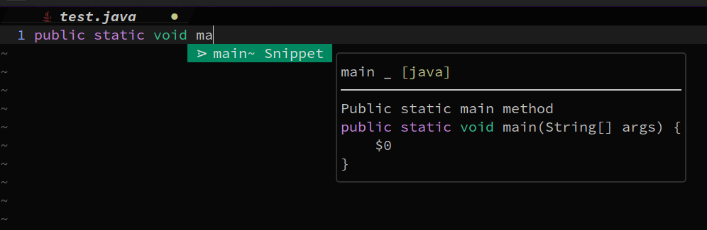
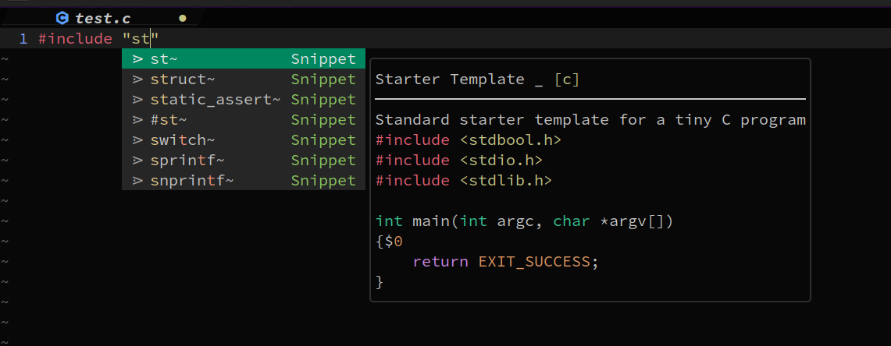
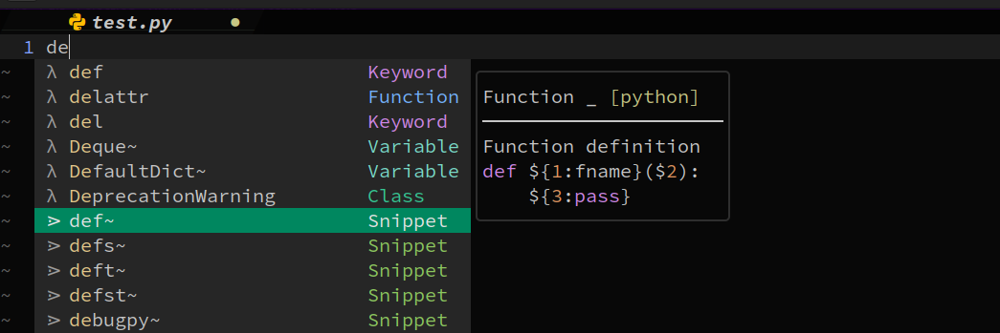
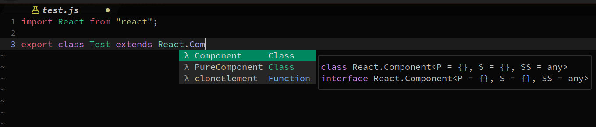
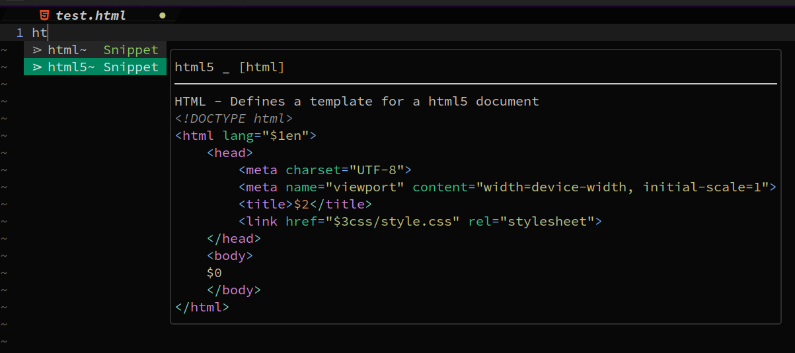
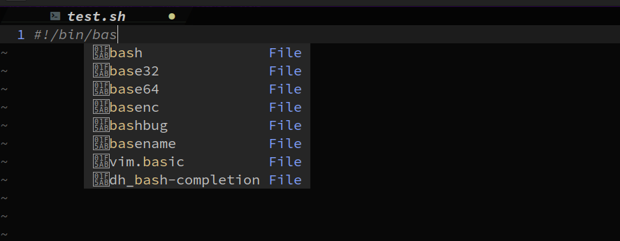

# NeoVim
## This is my fully functional NeoVim IDE Configuration!!!
Written in Lua, and portable on both Windows and Linux, it offers:
- File Tree Navigation System
- Integrated Bash terminal (can open multiple terminals in the same neovim instance)
- Syntax Highlighting
- Code Completion/Tab Completion (HTML/CSS, JavaScript, TypeScript, Java, Python, C/C++, Bash)
- Linting and error checking
- Buffer Windows/Tabs
- Ability to use system clipboard to copy/paste from outside nvim environment

## Basic Layout

## C++ Tab Completion

## Java Tab Completion

## C Tab Completion

## Python Tab Completion

## JavaScript Tab Completion

## HTML/CSS Tab Completion

## Bash Tab Completion

