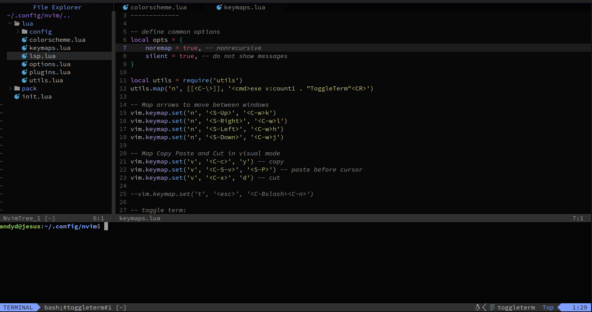
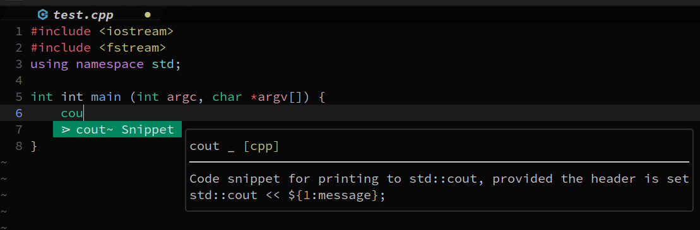
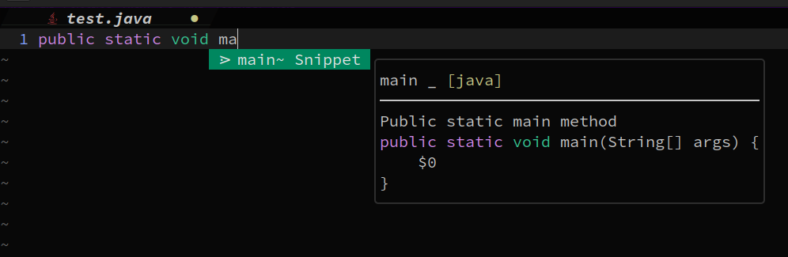
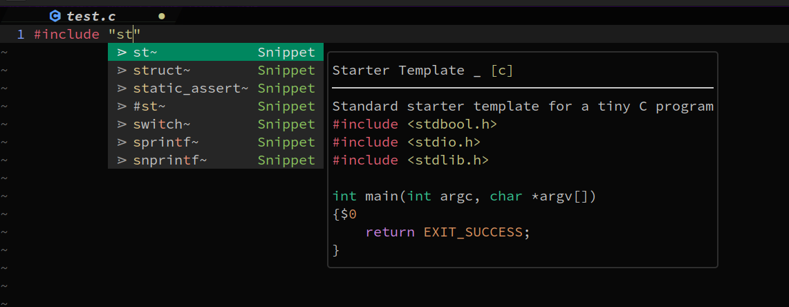
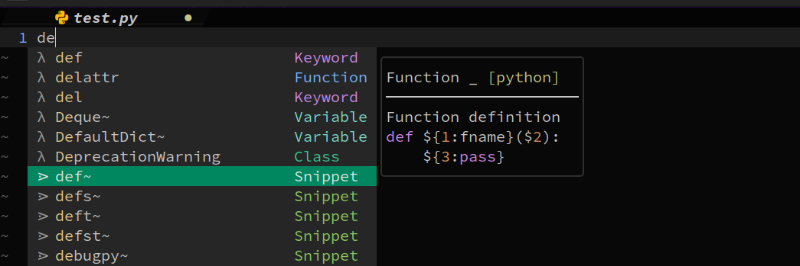
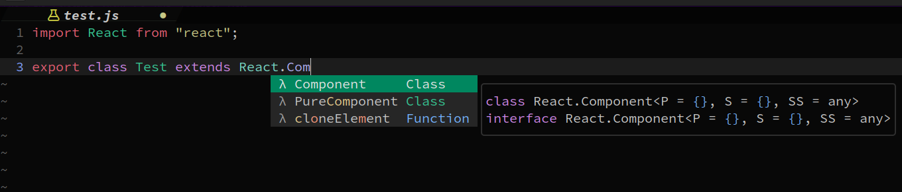
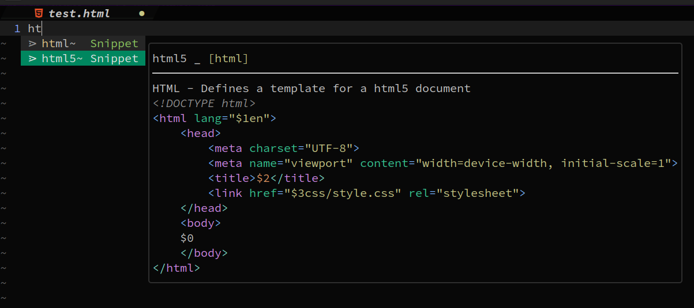
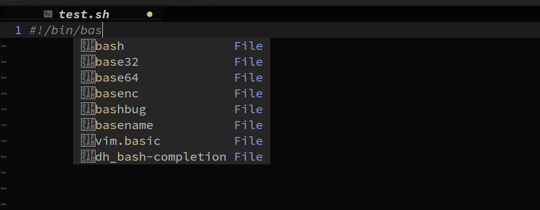

# NeoVim
## This is my fully functional NeoVim IDE Configuration!!!
Written in Lua, and portable on both Windows and Linux, it offers:
- File Tree Navigation System
- Integrated Bash terminal (can open multiple terminals in the same neovim instance)
- Syntax Highlighting
- Code Completion/Tab Completion (HTML/CSS, JavaScript, TypeScript, Java, Python, C/C++, Bash)
- Linting and error checking
- Buffer Windows/Tabs
- Ability to use system clipboard to copy/paste from outside nvim environment

## Plugins!!
To install the plugins I use . To set this up on your machine follow the instructions on the repo.

## Fonts
All of the fonts I use for this terminal are from . You must have a font installed to be able to see the Icons for this IDE.

## Code Completion
The Code completion comes with a few preset languagues, but any can be added and removed. The languages are:
- 
- 
- 
- 
- 
- 
-   
  
To Install these Language Servers I use the  plugin. For each language you have to install the Language Server onto your own machine, all information on installing these servers is available .

## Basic Layout

## C++ Tab Completion

## Java Tab Completion

## C Tab Completion

## Python Tab Completion

## JavaScript Tab Completion

## HTML/CSS Tab Completion

## Bash Tab Completion

